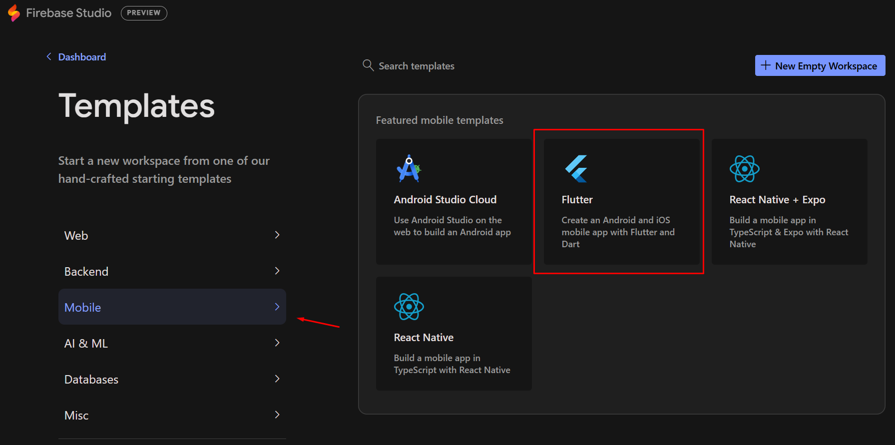
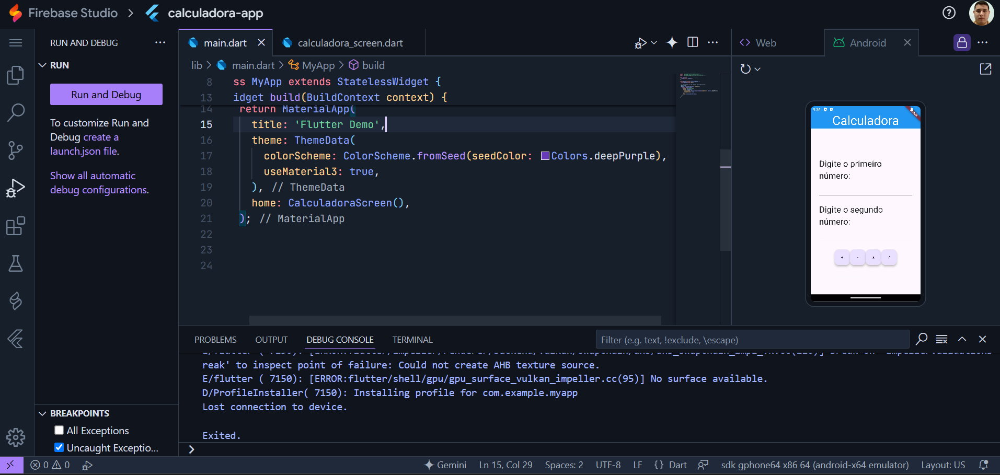

# Listagem de Veículos em Flutter

App de cadastro e listagem de veículos desenvolvido com Flutter e Dart em conjunto com os alunos dos cursos de tecnologia da [Faculdade VINCIT](https://www.faculdadevincit.edu.br/).

O app possui duas telas, uma para cadastro e outra para listagem, sendo esta a home do app. Atavés de um FloatActionButton no scafold, a tela de cadastro é acionada. 

As informações do app são persistidas em um banco de dados MySQL. Durante a aula do dia 29/04/2025, o banco de dados foi hospedado em um servidor da Azure.

O projeto ainda está em desenvolvimento, sendo desenvolvido durante as aulas de Programação para Dispositivos Móveis. Você poderá acessar a aula clicando na imagem a seguir:

[](https://www.youtube.com/watch?app=desktop&v=AUnZct2TOss)

## Plataformas utilizadas

Tradicionalmente, você poderá utilizar o ambiente de programação em Flutter, podendo ser instalado em Linux, Windows e macOS, ou então acessando a plataforma do [Firebase Studio](https://idx.google.com/).

### Instalação do ambiente local de desenvolvimento:

Para prosseguir com o ambiente local de desenvolvimento, você deve instalar os seguintes componentes:

- [SDK do Flutter](https://docs.flutter.dev/get-started/install)
- [Visual Studio Code](https://code.visualstudio.com/download)
- [Flutter Extension](https://marketplace.visualstudio.com/items/?itemName=Dart-Code.flutter)
-  [Dart Extension](https://marketplace.visualstudio.com/items/?itemName=Dart-Code.dart-code)

Também produzi um vídeo com as orientações a respeito da instalação do ambiente Flutter no microsoft Windows. Você poderá acessá-lo a qualquer momento clicando na imagem a seguir:

[](https://www.youtube.com/watch?app=desktop&v=42jiTBFmeIA)

### Utilização do Firebase Studio

O ambiente de programação do Firebase Studio permite o desenvolvimento de aplicativos online sem a necessidade de nenhum componente ser instalado. Na data em que esse material foi produzido, o Firebase Studio estava em desenvolvimento, e não possuía nenhum custo para ser utilizado. A única limitação é que somente poderia haver 5 projetos por conta.

Para a acessar o Firebase Studio, você deve clicar [neste link](https://idx.google.com/).

Em seguida, para desenvolver o aplicativo, você deve clicar em "New Workspace" e selecionar a opção "Mobile", presente no menu lateral esquerdo. Em seguida, você deve clicar em Flutter.



Por fim, ao clicar no botão, um novo projeto será configurado e você será redirecionado ao ambiente de programação com o VS Code Online:



## Dependências do Projeto
O projeto possui apenas uma única dependência de terceiros para funcionar, o [mysql_client](https://pub.dev/packages/mysql_client) na versão 0.0.27. Para instalar, você deve digitar no terminal:

```sh
flutter pub add mysql_client
```

Ou então adicionar a referência manualmente no arquivo [pubspec.yaml](/listagem_veiculos/pubspec.yaml):

```yaml
dependencies:
  mysql_client: ^0.0.27
```

## Criação do banco de dados gestao_veiculos
O SGBD utilizado no projeto é o MySQL. O banco de dados foi hospedado na Azure, e seu script de criação está disponível a seguir:

```sql
CREATE DATABASE IF NOT EXISTS gestao_veiculos;
USE gestao_veiculos;

CREATE TABLE veiculos(
	id INT PRIMARY KEY AUTO_INCREMENT,
    fabricante VARCHAR(255),
    modelo VARCHAR(255),
    cor VARCHAR(255),
    ano_fabricacao VARCHAR(255),
    placa VARCHAR(225)
);
```

## Trechos Importantes

O app possui duas telas, sendo [listagem_veiculos_screen.dart](/listagem_veiculos/lib/listagem_veiculos_screen.dart), sendo a home do app, e [cadastro_veiculos_screen.dart](/listagem_veiculos/lib/cadastro_veiculos_screen.dart), acessada clicando no FloatActionButton do scafold da listagem_veiculos_screen.dart.

**veiculo.dart**
```dart
class Veiculo {
  String? fabricante;
  String? modelo;
  String? anoFabricacao;
  String? cor;
  String? placa;

  Veiculo({
    required this.fabricante,
    required this.modelo,
    required this.anoFabricacao,
    required this.cor,
    required this.placa,
  });
}
```

**listagem_veiculos_screen.dart**

```dart
//Método de listagem das informações
  void listarVeiculos() {
    veiculoRepository.listar().then((value) {
      setState(() => veiculos = value);
    });
  }

//Scaffold
        floatingActionButton: FloatingActionButton(
          heroTag: "listagem.add",
          onPressed: () {
            Navigator.push(
                context,
                MaterialPageRoute(
                    builder: (context) => CadastroVeiculoScreen()));

              listarVeiculos();
          },
          child: const Icon(Icons.add),
        ),
```

**cadastro_veiculos_screen**
```dart
//Collumn/SizedBox
                child: FloatingActionButton(
                  heroTag: "cadastro.salvar",
                  onPressed: () {
                    var fabricante = fabricanteController.text;
                    var modelo = modeloController.text;
                    var anoFabricacao = anoFabricacaoController.text;
                    var cor = corController.text;
                    var placa = placaController.text;

                    var veiculo = Veiculo(
                        fabricante: fabricante,
                        modelo: modelo,
                        anoFabricacao: anoFabricacao,
                        cor: cor,
                        placa: placa);

                    veiculoRepository.inserir(veiculo).then((value) {
                      Navigator.pop(context, veiculo);
                    });
                  },
                  child: Text(
                    "Salvar",
                    style: TextStyle(fontSize: 30),
                  ),
                ),
```
**veiculo_repository.dart**
```dart
//Abrir conexão com banco de dados
  Future<MySQLConnection> conectarComBancoDeDados() async {
    var conn = await MySQLConnection.createConnection(
      host: "mysql.database.azure.com",
      port: 3306,
      userName: "userName",
      password: "password",
      databaseName: "gestao_veiculos",
    );

    return conn;
  }

//Incluir registro
  Future<Veiculo> inserir(Veiculo veiculo) async {
    var conn = await conectarComBancoDeDados();
    await conn.connect();

    String comando = "INSERT INTO veiculos";
    comando += "(fabricante, modelo, cor, ano_fabricacao, placa)";
    comando += " VALUES (:fabricante, :modelo, :cor, :ano_fabricacao, :placa )";

    var result = await conn.execute(comando, {
      "fabricante": veiculo.fabricante,
      "modelo": veiculo.modelo,
      "ano_fabricacao": veiculo.anoFabricacao,
      "placa": veiculo.placa,
      "cor": veiculo.cor,
    });

    veiculo.id = result.lastInsertID;
    conn.close();

    return veiculo;
  }

//Listar registros
  Future<List<Veiculo>> listar() async {
    List<Veiculo> contatos = [];

    var conn = await conectarComBancoDeDados();
    await conn.connect();

    String comando = "SELECT * FROM veiculos";
    var result = await conn.execute(comando);

    result.rows.forEach((row) {
      Veiculo contato = Veiculo(
          fabricante: row.colByName("fabricante"),
          modelo: row.colByName("modelo"),
          anoFabricacao: row.colByName("ano_fabricacao"),
          cor: row.colByName("cor"),
          placa: row.colByName("placa"));

      contato.id = BigInt.parse(row.colByName("id")!);

      contatos.add(contato);
    });

    conn.close();
    return contatos;
  }

//Excluir Registros
  Future<void> excluir(BigInt? id) async {
    var conn = await conectarComBancoDeDados();
    await conn.connect();

    String command = "DELETE FROM veiculos WHERE id =:id";
    await conn.execute(command, {"id": id});

    conn.close();
  }
```
---
Desenvolvido por Alex Rocha


